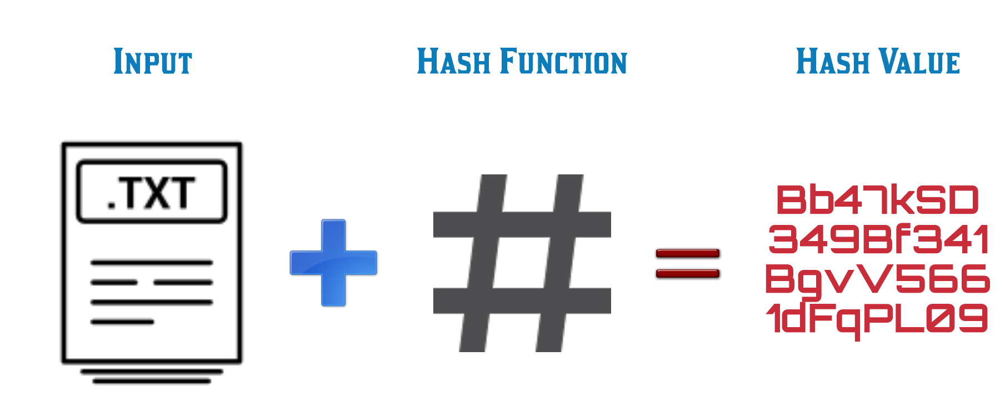

# 1-oji užduotis: Hash generatorius

Maišos funkcijos (angl. *hash function*) yra labai svarbi *blockchain* (pvz. *Bitcoin*) protokolų dalis. Hash'avimo metu bet koks įvedimo tekstas (*m*) matematinės *hash* funkcijos dėka (*h = h(m)*) yra paverčiamas unikaliu fiksuoto dydžio pseudo-atsitiktiniu skaičiumi, vadinamu *maišos kodu*. Tradicinė tokių *hash* generatorių veikimo schema yra:

Kad geriau suvokti užduoti, rekomenduotina pasibandyti, kaip veikia vieni geriausiai ir plačiausiai naudojamų [maišos kodo genetorių](https://emn178.github.io/online-tools/sha256.html).

## Užduoties formuluotė

Sukurkite Jūsų (t.y. pabandykite neieškoti *hash* funkcijų pavyzdžių Internete) maišos (*hash*) funkciją (*hash* kodų generatorių), kuris pasižymėtų šiais *hash* funkcijoms keliamais reikalavimais:

1. Maišos funkcijos įėjimas (angl. *input*) gali būti <u>bet kokio dydžio</u> simbolių eilutė (angl. *string*), pateikta `Command Line Argument` formatu.
2. Maišos funkcijos išėjimas (angl. *output*) visuomet yra <u>to paties fiksuoto dydžio</u> rezultatas.
3. Maišos funkcijos reikšmė/kodas (hash‘as) bet kokiai input reikšmėi yra apskaičiuojamas nesunkiai - efektyviai.
4. Maišos funkcija yra deterministinė, t. y., tam pačiam įvedimui (angl. *input*'ui) išvedimas (angl. *output*'as) <u>visuomet</u> yra tas pats.
5. Iš funkcijos rezultato (*output*'o) praktiškai neįmanoma atgaminti įvedimo (*input*'o).
6. Praktiškai neįmanoma surasti tokių dviejų skirtingų argumentų (*input*'ų), kad jiems gautume tą patį *hash*'ą, t. y.,: *m1 != m2*, bet *h(m1) = h(m2)*.
7. Bent minimaliai pakeitus įvedimą, pvz.vietoj "Lietuva" pateikus "lietuva", maišos funkcijos rezultatas-kodas turi skirtis iš esmės:

| Įvedimas (*input*) | Išvedimas (*hash'as* gautas iš  SHA256)                      |
| ------------------ | ------------------------------------------------------------ |
| lietuva            | f51f6afefb2616f48bbddeeada2d729244a00fa0817f9ceb5c5419aa04b31172 |
| Lietuva            | 5109820f748796128b8bafd3806d05511bc89ad77fc3cda960facf37a639bc7f |
| Lietuva!           | f4ac741acca7dd6f5f7e6fd1e382eca604a26ba21a83a6a2215d7be830a8faa6 |

### Reikalavimai versijai (`v0.1`) (Preliminarus terminas: 2019-09-26)

- Pagal užduoties formuluotę, realizuokite *hash*'ų generatorių (pageidautina `C++` kalboje). Programos realizavimas turi būti versijuojamas (pageidautina *git*'e) ir patalpintas Jūsų Github'e.
- Realizacijoje turi būti galimybė *input*'ą įvesti tiek "ranka", tiek ir nuskaityti jį iš failo.
- Atlikite eksperimentinę analizę, kurios metu įsitikinkite, kad Jūsų *hash* funkcija-generatorius iš tiesų pasižymi aukščiau aprašytais *hash* funkcijoms keliamais reikalavimais. Atliktą tyrimą išsamiai aprašykite `README` faile. 
- Eksperimentinis tyrimas-analizė turi būti atkartojamas, t. y., paskaitos metu reikės pademonstruoti, kaip vyksta tyrimas ir kaip argumentavote, kad Jūsų maišos funkcija pasižymi šiomis savybėmis.
