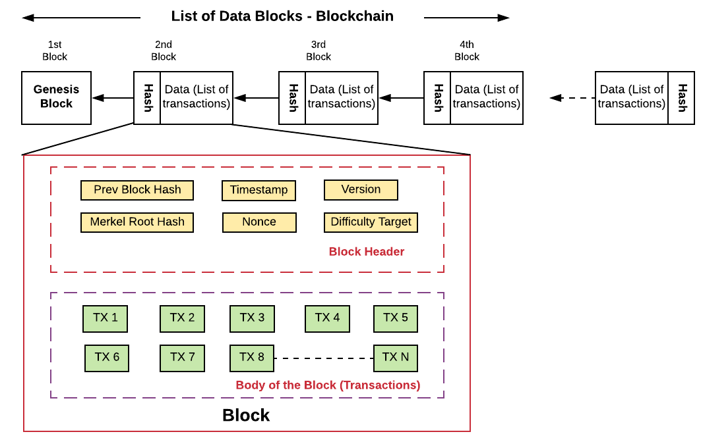

# 2-oji užduotis: Supaprastintos blokų grandinės (blockchain) kūrimas

Pagrindinis šios užduoties tikslas yra sukurti supaprastintą blokų grandinę (angl. *blockchain*), kurios galima struktūra yra pateikta žemiau:



Išskirtume kelis svarbius blokų grandinės aspektus:

- Blokų grandinė (blockchain) susidaro iš sąrašo vienas po kito einančių blokų, kurių kiekvienas susietas su prieš tai buvusio bloko hash'u. 

- Kiekvieno iš blokchain grandinės bloko struktūra yra sudaryta iš dviejų esminių komponentų: **antraštės** (angl. *header*), kurią šiuo atveju sudaro:

  - Prieš tai buvusio bloko hash'as (`Prev Block Hash`)
  - Laiko žymės (`Timestamp`)
  - Jūsų blokams naudojamos duomenų struktūros versija (`Version`)
  - Visų bloko transakcijų binarinio Merkle medžio hash'as (`Merkel Root Hash`)
  - Atsitiktinis skaičius, kuris buvo panaudotas reikiamo sudėtingumo (nusakomo iš eilės einančių nulių skaičiumi hash'o pradžioje) naujojo bloko hash'ui gauti (`Nonce`)
  - Naujojo bloko hash'o radimo sudėtingumas (`Difficulty Target`)

  ir **pagrindinės** (angl. *body*) bloko duomenų dalies, kurią sudaro visos į konkretų bloką įeinančios transakcijos.

## Pirminė užduoties formuluotė

Sukurkite "centralizuotą" blokų grandinę (blockchain'ą) ir susimuliuokite blokų grandinės veikimą kuo natūralesnėmis sąlygomis. Norint tai pasiekti, preliminari veiksmų seka (nebūtinai eilės tvarka, tokia kokia čia nurodyta) galėtų būti tokia:

1. Sugeneruoti ~1000 tinklo vartotojų (aka user'ių), kurie turėtų bent tris atributus: `vardą`, viešąjį _hash_ raktą (`public_key`) ir tam tikros valiutos (galite pasivadinti savo vardu :smile: ) atsitiktinį balansą, pvz. nuo 100 iki 1000000 vienetų.
2. Sugeneruoti tam tikrą skaičių, pvz., transkacijų _pool_'ą sudarytą iš 10000 atsitiktinių transakcijų (jų struktūrą kol kas yra neformalizuota) tarp visų vartotojų, kurių metu jie vienas kitam atlikinėtų tam tikro atsitiktinio dydžio pinigų pervedimus.
3. Iš šių transakcijų atsitiktinai pasirinkti 100-ą (tarsime, kad blokas talpins apie 100 transakcijų) ir jas priskirti naujam sugeneruotam blokui (kurį kitame žingsnyje dar reikės "iškąsti"), kurio struktūra nurodyta paveiksle aukščiau.
4. Realizuoti naujų blokų kasimo (angl. *mining*) Proof-of-Work (PoW) procesą, kurio tikslas yra surasti naujam blokui hash'ą, tenkinantį `Difficulty Targer` reikalavimą, t.y., hash'o pradžioje esančių nulių skaičių.
5. Suradus tokį naujo bloko hash'ą, bloką pridėti prie grandinės. 
6. Kartoti 3-5 žingsnius tol, kol yra laisvų transakcijų. Galima būtų įtraukti ir visus 1-5 žingsnius, tokiu būdu įtraukiant naujų vartotojų ir/ar transakcijų kūrimą, o ciklą stabdyti naudojantis kitomis sąlygomis.

## Reikalavimai versijai (`v0.1`) (Terminas: 2019-10-18)

- Visus šios užduoties žingsnius realizuokite taip, kaip Jūsų dabartinis *blockchain* supratimas sako. Hash'avimo procesui turite naudoti Jūsų pirmąjam darbui sukurtas _hash_ funkcijas. 
- Šiai versijai sukurkite releas'ą ir `README` faile tvarkingai aprašykite, kaip naudotis Jūsų šia _blockchain_' versija, tačiau jos atsiskaityti nereikia. Reikės atsiskaityti modernesnę Jūsų blockchain versiją.

## Reikalavimai versijai (`v0.2`) (Terminas: 2019-11-01)

- Atlikite transakcijų pool'e esančių transakcijų verifikavimą:
  - **Balanso tikrinimas**: Jeigu Jūsų sukurtoje transakcijoje vartotojas A siunčia tam tikrą pinigų sumą vartotojui B, tačiau jo balansas yra mažesnis negu siunčiama suma, tą transakciją reiktų ištrinti iš transakcijų pool'o.
  - **Transakcijos hash'o tikrinimas**: Jeigu Jūsų transakcijų struktūra neturi transakcijos ID lauko, tuomet papildykite juo! To lauko reikšmė turi būti transakcijos informacijos hash'as. Tuomet poool'o lygmenyje papildomai realizuokite patikrinimą ar tranksakcijos informacijos hash'as sutampa su transakcijos ID. Tokiu būdu įsitikinsite, kad transakcija nebuvo suklastota, kol ji "keliavo" iki transakcijų pool'o.
- Patobulinkite blokų kasimo (_mininimo_) procesą pagal tokią (ar panašią) logiką:
  - Pirmiausiai pagal aukščiau pateiktą aprašą 3-ame žingsnyje iš visų transakcijų _pool_'o, sudarykite ne vieną, o penkis naujus potencialius blokus (kandidatus): 1A, 1B, 1C, 1D, 1E, sudarytus iš 100 atsitiktinai pasirinktų tranksakcijų, kurios blokų kandidatuose gali persidengti.
  - Tuomet atsitiktinai pasirinkite vieną iš tų penkių blokų-kandidatų ir su juo tam tikrą fiksuotą laiką (pvz., iki 1 sek.) arba fiksuojant maksimalų hash'ų bandymų skaičių (pvz. iki 100000) atlikite _mininimo_ procesą kaip aprašyta ankstesnės užduoties 4-ame žingsnyje. Jeigu po to laiko, nebuvo šiam atsitiktinai pasirinktam blokui-kandidatui surastas hash'as, tenkinantis `Difficulty Targer` reikalavimą, tą procesą pakartokite su atsitiktinai pasirinktu vienu iš likusių (keturių, trijų ir t.t.) kandidatų.
  - Jeigu procesą pakartojus su visais penkiais naujais blokais-kandidatais, nebuvo surastas reikiamų savybių hash'as, tuomet pailginkite _mininimo_ procesą (pvz. iki 2 sek.) ar padidinus maksimalų hash'ų bandymų skaičių (pvz. iki 200000) ir pakartokite aukščiau aprašytą procesą.
  

Tokiu būdu nuosekliame programos veikimo kontekste gana naiviai sumodeliuojame "decentralizuotą" naujų blokų kasimą - _mininimą_.

## Reikalavimai versijai (`v0.3`) (Preliminarus terminas: 2019-11-21)

-  Šiai užduočiai atlikti, pirmiausia Jums reikia įsidiegti papildomą biblioteką - [libbitcoin-system: Bitcoin Cross-Platform C++ Development Toolkit](https://github.com/libbitcoin/libbitcoin-system), kurios [įdiegimo instrukcijos](https://github.com/libbitcoin/libbitcoin-system#installation) kiekvienai iš populiariausių OS yra detaliai pateiktos.
-  Vienas iš Jūsų kuriamo *blockchain*'o bloko antraštės elementų yra Merkle medžio hash'as. 
  - **Planas minimum**: Jeigu dar neturite, realizuokite Merkle medžio hashavimo funkciją. Kaip orientyru, galite naudotis `create_merkle()` funkcija, į kurią nuoroda pateikta žemiau.
  - **Planas maximum (papildomas 1 balas prie užduoties!)**: Adaptuokite (modifikuokite) ir integruokite į Jūsų realizaciją funkciją `create_merkle()`, kuri paremta [libbitcoin](https://github.com/libbitcoin/libbitcoin-system)  biblioteka, o funkcijos realizacija paimta (su smulkiomis modifikacijomis) iš [Mastering Bitcoin knygos](https://github.com/bitcoinbook/bitcoinbook):

```cpp
//create_merkle funkcijos realizacija
#include <bitcoin/bitcoin.hpp>

bc::hash_digest create_merkle(bc::hash_list& merkle)
{
    // Stop if hash list is empty or contains one element
    if (merkle.empty())
        return bc::null_hash;
    else if (merkle.size() == 1)
        return merkle[0];

    // While there is more than 1 hash in the list, keep looping...
    while (merkle.size() > 1)
    {
        // If number of hashes is odd, duplicate last hash in the list.
        if (merkle.size() % 2 != 0)
            merkle.push_back(merkle.back());
        // List size is now even.
        assert(merkle.size() % 2 == 0);

        // New hash list.
        bc::hash_list new_merkle;
        // Loop through hashes 2 at a time.
        for (auto it = merkle.begin(); it != merkle.end(); it += 2)
        {
            // Join both current hashes together (concatenate).
            bc::data_chunk concat_data(bc::hash_size * 2);
            auto concat = bc::serializer<
                decltype(concat_data.begin())>(concat_data.begin());
            concat.write_hash(*it);
            concat.write_hash(*(it + 1));
            // Hash both of the hashes.
            bc::hash_digest new_root = bc::bitcoin_hash(concat_data);
            // Add this to the new list.
            new_merkle.push_back(new_root);
        }
        // This is the new list.
        merkle = new_merkle;

        // DEBUG output -------------------------------------
        std::cout << "Current merkle hash list:" << std::endl;
        for (const auto& hash: merkle)
            std::cout << "  " << bc::encode_base16(hash) << std::endl;
        std::cout << std::endl;
        // --------------------------------------------------
    }
    // Finally we end up with a single item.
    return merkle[0];
}
```

kuria naudotis galite taip:

```cpp
int main()
{
    // Replace these hashes with ones from a block to reproduce the same merkle root.
    bc::hash_list tx_hashes{{
        bc::hash_literal("8c14f0db3df150123e6f3dbbf30f8b955a8249b62ac1d1ff16284aefa3d06d87"),
        bc::hash_literal("fff2525b8931402dd09222c50775608f75787bd2b87e56995a7bdd30f79702c4"),
        bc::hash_literal("6359f0868171b1d194cbee1af2f16ea598ae8fad666d9b012c8ed2b79a236ec4"),
        bc::hash_literal("e9a66845e05d5abc0ad04ec80f774a7e585c6e8db975962d069a522137b80c1d"),
    }};
    const bc::hash_digest merkle_root = create_merkle(tx_hashes);
    std::cout << "Result: " << bc::encode_base16(merkle_root) << std::endl;
    return 0;
}
```

Tokiu būdu gausite, kad Jūsų Merkle medžio transakcijų hash'as yra apskaičiuojamas analogiškai Bitcoin'ui.

---
Iš karto norime užbėgti įvykiams už akių ir pasakyti, kad kitose užduoties versijose atsiras griežtesni reikalavimai, atsižvelgiant kaip iš tiesų _blockchain_ veikia ar yra realizuota. Kaip pvz., atsiras transakcijų validavimas; naujojo bloko hash'o gavimas, kur input'as į hash'o funkciją yra sudarytas iš bloko antraštės parametrų; transakcijų Merkle medžio hash'o gavimas ir pan. Viskas bus sukonkretinta greitu laiku.
